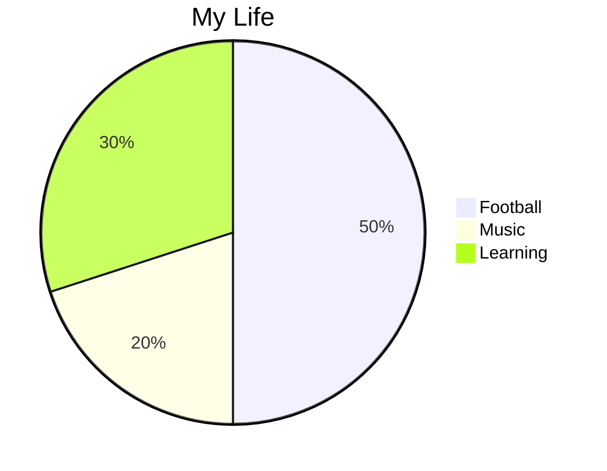
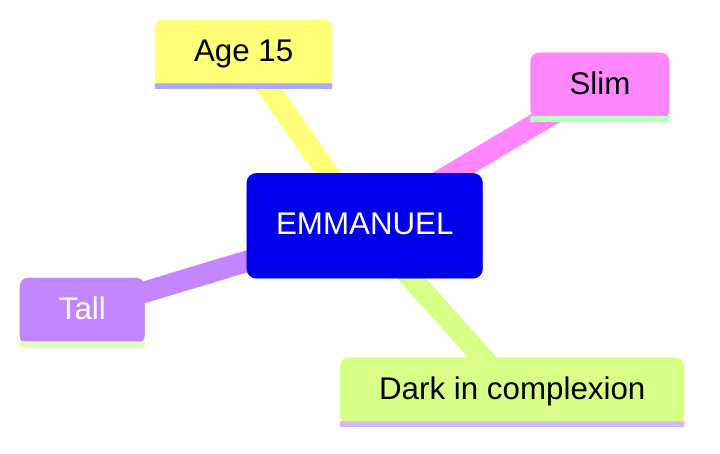

## <ins>My Country<ins>
Sometime ago there was a country called Gold Coast and this country was rich and had many natural resources as listed below,
* Gold
* Diamond
* Bauxite
* Manganese
* Cocoa
  There was happiness everywhere around the country but one thing that they lacked and which was very important was education. Gold Coast had no schools or no educated people. In **1471** the *Portuguese* who happened to be the first Europeans to arrive at the coast came and encountered a veriety of African kingdoms, some of these kingdoms had golds and were deposited in soil. In **1483** the *Portuguese* built a Castle at Elmina, the first European settlement and they had an increased trade.
From here they got gold and slaves in exchange for European goods, such as guns, beads, metal knives, mirrors, etc.
The trading became successful between them and the news spread everywhere and traders from countries like  British, Dutch, Swedish, Danish, etc, arrived as well.
It went on for a while and during that moment a lot happened such as British Colonization1, Barter trading2.
In 1765, Philip Quaque set up a school in his house at Cape Coast and that became the first elementary school in the country.
In 1957 Gold Coast gained her independence and was named ***GHANA***.
[this link](https://gist.github.com/EMMANUELKUS/f05998d2aff691810fba75ab180387bd) will take you to a page that will tell you more about *GHANA*.
 
  1:From 1821 the british colonized Gold Coast in other words they ruled them, until Ghana gained her indepenedence.
  
  2:The act of exchanging goods between two parties without the use of money.

## My Life
> God created human being and gave everybody life. Life is a precious thing and very valuable and it's always a moment to enjoy. I have divided my life into a few areas,

* Football 
* Music 
* Learning
  
This is how I live my life.

[(https://www.youtube.com/@emmanuelkusiappiah9218)
                            

